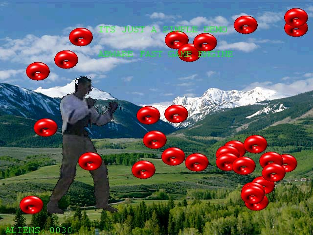



## Abware's fast game engine

### Description

NEW && IMPROVED. now its even better and faster - tons of functions to make your fast arcades. the source code is included for the component and for the demo app but if you dont want to compile it using VC6 you can regsvr the compiled dll. JUST DONT FORGET TO REPLACE THE bll extension to dll (PSC doesnt allow to upload dlls) HAVE FUN (and lots of fast games)

Abware's game engine is a fast activex component written in c++ especially for vb programmers. the component allow you to design a full screen fast arcade game using directx 7 or later. in just a few lines of code you can add backgrounds, sprites and actions (animations) to make your favorite arcade games. the component uses ultra fast c++ code built from the scratch using simple techniques like linked list and structures to make it even faster. after uploading the zip file read the instructions rtf file first and then compile the c++ project (abSpriteEX1.dsw) before opening and executing the vb project (testapp.vbp). make sure your VC compiler is set to the correct directx libraries (need to have directx7 SDK on your computer) this stuff is for advanced programmers but if you need any help you can email me at :adib@malam.com and ill help you as much as i can. anyway those of you that will manage to activate both the VC and VB compilers will have an industry quality arcade games engine with full open source code in hands. enjoy it and dont forget to vote for me bye.
 
### More Info
 

             |
---                |---
**Submitted On**   |2001-07-30 19:19:56
**By**             |[ADI BARDA](https://github.com/Planet-Source-Code/PSCIndex/blob/master/ByAuthor/adi-barda.md)
**Level**          |Advanced
**User Rating**    |2.5 (15 globes from 6 users)
**Compatibility**  |VB 6\.0
**Category**       |[Games](https://github.com/Planet-Source-Code/PSCIndex/blob/master/ByCategory/games__1-38.md)
**World**          |[Visual Basic](https://github.com/Planet-Source-Code/PSCIndex/blob/master/ByWorld/visual-basic.md)
**Archive File**   |[Abware's f238137312001\.zip](https://github.com/Planet-Source-Code/adi-barda-abware-s-fast-game-engine__1-23319/archive/master.zip)

